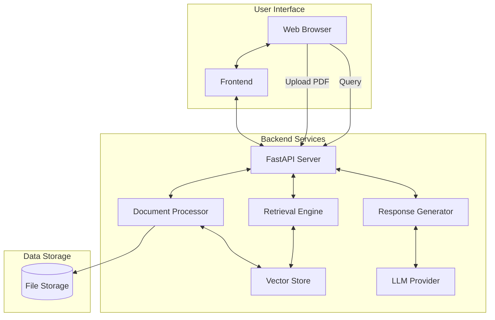
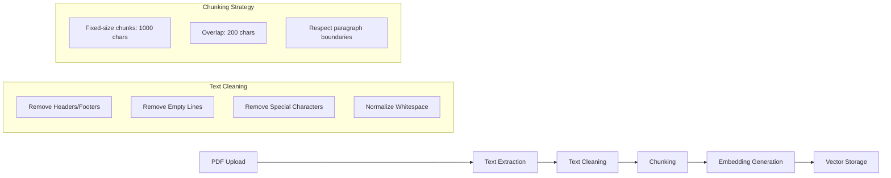

# System Architecture

## High-Level Overview

## Component Details

### 1. Frontend
- **Technology Stack**: HTML5, CSS3, JavaScript (Vanilla)
- **Key Features**:
  - Responsive design with mobile support
  - Real-time chat interface
  - Drag-and-drop file upload
  - Progress indicators
  - Dark/light theme support

### 2. Backend (FastAPI)
- **API Endpoints**:
  - `POST /api/upload`: Document ingestion and processing
  - `POST /api/chat`: Query processing and response generation
  - `GET /api/documents`: List processed documents
  - `DELETE /api/documents/{doc_id}`: Remove a document

### 3. Document Processing Pipeline

### 4. Retrieval Engine
- **Components**:
  - Embedding Model: `sentence-transformers/all-mpnet-base-v2`
  - Vector Store: ChromaDB (default) or FAISS
  - Hybrid Search: Combines semantic and keyword search
  - Reranking: Cross-encoder for improved relevance

### 5. Response Generation
- **Workflow**:
  1. Retrieve top-k relevant chunks
  2. Formulate prompt with context
  3. Generate response using LLM
  4. Add citations and confidence scores
  5. Format and return response

## Data Flow

1. **Document Ingestion**:
   - User uploads PDF
   - System extracts and preprocesses text
   - Text is chunked and embedded
   - Embeddings are stored in vector database

2. **Query Processing**:
   - User submits query
   - Query is embedded
   - Relevant chunks are retrieved
   - Response is generated using LLM
   - Formatted response is returned

## Performance Considerations

### Caching
- Implemented at multiple levels:
  - Browser-level caching for static assets
  - API response caching
  - Vector store caching

### Scaling
- Stateless backend allows horizontal scaling
- Vector database sharding for large document collections
- Asynchronous processing for CPU-intensive tasks

## Security

- API key management via environment variables
- Input validation and sanitization
- Rate limiting
- CORS configuration
- Secure file handling

## Monitoring and Logging

- Structured logging for all operations
- Performance metrics collection
- Error tracking and alerting
- Usage analytics

## Future Enhancements

1. **Multi-modal Support**:
   - Handle images and tables in documents
   - Support for scanned PDFs using OCR

2. **Advanced Features**:
   - Document summarization
   - Automatic topic extraction
   - Multi-document comparison

3. **Performance Optimizations**:
   - Streaming responses
   - Batch processing for large documents
   - Model quantization for faster inference
